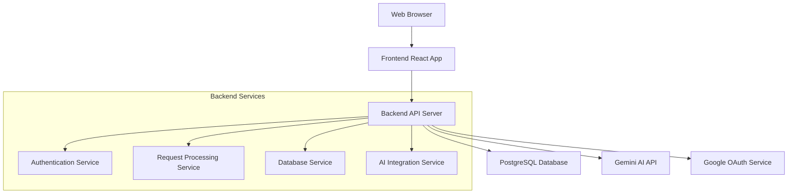

# Design Document

## Overview

The Gemini Web Application is a full-stack web application that provides users with AI-powered report generation through Google's Gemini API. The system supports both anonymous and registered users with different request quotas, implements secure input processing, and maintains comprehensive logging in PostgreSQL.

## Architecture

### High-Level Architecture



### Technology Stack

**Frontend:**
- React.js with TypeScript for type safety
- Tailwind CSS for responsive styling
- Axios for API communication
- React Router for navigation

**Backend Options:**

*Java Spring Boot (Selected)*
- Spring Boot 3.x with Java 17+
- Spring Security for authentication and authorization
- Spring Data JPA with Hibernate for database operations
- Spring Web for REST API development
- Spring Boot Actuator for monitoring and health checks
- Maven for dependency management


**Database:**
- PostgreSQL for persistent data storage
- Redis for session management and caching

**External Services:**
- Google Gemini AI API
- Google OAuth 2.0 for authentication

## Components and Interfaces

### Frontend Components

#### 1. Main Application Component
- Manages global state and routing
- Handles user authentication state
- Provides error boundaries

#### 2. Prompt Input Component
- Structured form for user prompt input
- Real-time validation feedback
- Character count and format guidance
- Loading states during processing

#### 3. Authentication Component
- Google OAuth integration
- Email registration form
- Login/logout functionality
- User quota display

#### 4. Report Display Component
- Formatted AI response rendering
- Markdown support for rich text
- Copy-to-clipboard functionality
- Request history access

### Backend API Endpoints

#### Authentication Endpoints (Spring Boot)
```java
@RestController
@RequestMapping("/api/auth")
public class AuthController {
    @PostMapping("/google") // Google OAuth callback
    @PostMapping("/email")  // Email registration
    @PostMapping("/login")  // Email login
    @PostMapping("/logout") // User logout
    @GetMapping("/me")      // Current user info
}
```

#### Core Application Endpoints (Spring Boot)
```java
@RestController
@RequestMapping("/api")
public class PromptController {
    @PostMapping("/prompt")      // Submit prompt for AI processing
    @GetMapping("/user/quota")   // Get remaining request quota
    @GetMapping("/user/history") // Get request history
}
```

### Database Schema

#### Users Table
```sql
CREATE TABLE users (
    id UUID PRIMARY KEY DEFAULT gen_random_uuid(),
    email VARCHAR(255) UNIQUE,
    google_id VARCHAR(255) UNIQUE,
    is_anonymous BOOLEAN DEFAULT true,
    fingerprint VARCHAR(255), -- For anonymous user tracking
    created_at TIMESTAMP DEFAULT NOW(),
    updated_at TIMESTAMP DEFAULT NOW()
);
```

#### Request_Logs Table
```sql
CREATE TABLE request_logs (
    id UUID PRIMARY KEY DEFAULT gen_random_uuid(),
    user_id UUID REFERENCES users(id),
    user_prompt TEXT NOT NULL,
    system_prompt TEXT NOT NULL,
    ai_response TEXT,
    status VARCHAR(50) NOT NULL, -- 'success', 'error', 'pending'
    error_message TEXT,
    ip_address INET,
    user_agent TEXT,
    created_at TIMESTAMP DEFAULT NOW()
);
```

#### User_Sessions Table
```sql
CREATE TABLE user_sessions (
    id UUID PRIMARY KEY DEFAULT gen_random_uuid(),
    user_id UUID REFERENCES users(id),
    session_token VARCHAR(255) UNIQUE NOT NULL,
    expires_at TIMESTAMP NOT NULL,
    created_at TIMESTAMP DEFAULT NOW()
);
```

## Data Models

### Java Entity Models (Spring Boot + JPA)

#### User Entity
```java
@Entity
@Table(name = "users")
public class User {
    @Id
    @GeneratedValue(strategy = GenerationType.UUID)
    private UUID id;
    
    @Column(unique = true)
    private String email;
    
    @Column(name = "google_id", unique = true)
    private String googleId;
    
    @Column(name = "is_anonymous")
    private Boolean isAnonymous = true;
    
    private String fingerprint;
    
    @Column(name = "created_at")
    private LocalDateTime createdAt;
    
    @Column(name = "updated_at")
    private LocalDateTime updatedAt;
    
    // Getters, setters, constructors
}
```

#### Request Log Entity
```java
@Entity
@Table(name = "request_logs")
public class RequestLog {
    @Id
    @GeneratedValue(strategy = GenerationType.UUID)
    private UUID id;
    
    @ManyToOne(fetch = FetchType.LAZY)
    @JoinColumn(name = "user_id")
    private User user;
    
    @Column(name = "user_prompt", columnDefinition = "TEXT")
    private String userPrompt;
    
    @Column(name = "system_prompt", columnDefinition = "TEXT")
    private String systemPrompt;
    
    @Column(name = "ai_response", columnDefinition = "TEXT")
    private String aiResponse;
    
    @Enumerated(EnumType.STRING)
    private RequestStatus status;
    
    @Column(name = "error_message", columnDefinition = "TEXT")
    private String errorMessage;
    
    @Column(name = "ip_address")
    private String ipAddress;
    
    @Column(name = "user_agent", columnDefinition = "TEXT")
    private String userAgent;
    
    @Column(name = "created_at")
    private LocalDateTime createdAt;
    
    // Getters, setters, constructors
}

enum RequestStatus {
    SUCCESS, ERROR, PENDING
}
```

### DTO Models
```java
public class PromptRequest {
    private String prompt;
    private String userFingerprint;
    // Getters, setters, validation annotations
}

public class PromptResponse {
    private boolean success;
    private String report;
    private String error;
    private int remainingRequests;
    // Getters, setters, constructors
}
```

## Error Handling

### Client-Side Error Handling
- Network connectivity errors with retry mechanisms
- Form validation errors with user-friendly messages
- Authentication errors with redirect to login
- Rate limiting errors with clear quota information

### Server-Side Error Handling
- Input validation with detailed error responses
- Database connection failures with graceful degradation
- Gemini API failures with retry logic and fallback messages
- Authentication errors with proper HTTP status codes

### Error Response Format
```typescript
interface ErrorResponse {
  success: false;
  error: {
    code: string;
    message: string;
    details?: any;
  };
}
```

## Java Spring Boot Project Structure

```
src/
├── main/
│   ├── java/
│   │   └── com/example/geminiapp/
│   │       ├── GeminiWebAppApplication.java
│   │       ├── config/
│   │       │   ├── SecurityConfig.java
│   │       │   ├── DatabaseConfig.java
│   │       │   └── GeminiApiConfig.java
│   │       ├── controller/
│   │       │   ├── AuthController.java
│   │       │   └── PromptController.java
│   │       ├── service/
│   │       │   ├── UserService.java
│   │       │   ├── AuthService.java
│   │       │   ├── PromptService.java
│   │       │   └── GeminiApiService.java
│   │       ├── repository/
│   │       │   ├── UserRepository.java
│   │       │   └── RequestLogRepository.java
│   │       ├── entity/
│   │       │   ├── User.java
│   │       │   └── RequestLog.java
│   │       ├── dto/
│   │       │   ├── PromptRequest.java
│   │       │   ├── PromptResponse.java
│   │       │   └── UserResponse.java
│   │       └── exception/
│   │           ├── GlobalExceptionHandler.java
│   │           └── CustomExceptions.java
│   └── resources/
│       ├── application.yml
│       ├── application-dev.yml
│       └── application-prod.yml
└── test/
    └── java/
        └── com/example/geminiapp/
            ├── controller/
            ├── service/
            └── repository/
```

## Security Considerations

### Input Security
- Prompt sanitization to prevent injection attacks
- Length limits to prevent resource exhaustion
- Content filtering for inappropriate material
- Rate limiting per IP and per user

### Authentication Security
- Secure session management with HTTP-only cookies
- CSRF protection for state-changing operations
- OAuth token validation and refresh
- Password hashing for email authentication (bcrypt)

### Data Protection
- Environment variables for sensitive configuration
- Database connection encryption
- API key rotation capabilities
- User data anonymization options

## Testing Strategy

### Unit Testing
- Service layer functions for business logic
- Database model validation and constraints
- Input sanitization and validation functions
- Authentication and authorization logic

### Integration Testing
- API endpoint testing with different user types
- Database operations and transactions
- External API integration (Gemini AI)
- Authentication flow testing

### End-to-End Testing
- Complete user journeys from prompt to report
- Anonymous to registered user conversion flow
- Error scenarios and recovery paths
- Cross-browser compatibility testing

## Performance Considerations

### Frontend Optimization
- Code splitting for faster initial load
- Lazy loading of non-critical components
- Caching of user session data
- Optimized bundle size with tree shaking

### Backend Optimization
- Database query optimization with proper indexing
- Connection pooling for database and external APIs
- Response caching for repeated requests
- Asynchronous processing for AI API calls

### Scalability Planning
- Horizontal scaling capability for API servers
- Database read replicas for improved performance
- CDN integration for static assets
- Load balancing for high availability

## Deployment Architecture

### Development Environment
- Docker containers for consistent development
- Local PostgreSQL and Redis instances
- Environment-specific configuration files
- Hot reloading for rapid development

### Production Environment
- Container orchestration (Docker Compose or Kubernetes)
- Managed PostgreSQL service (AWS RDS or similar)
- Redis cluster for session management
- SSL/TLS termination at load balancer
- Environment variable management for secrets